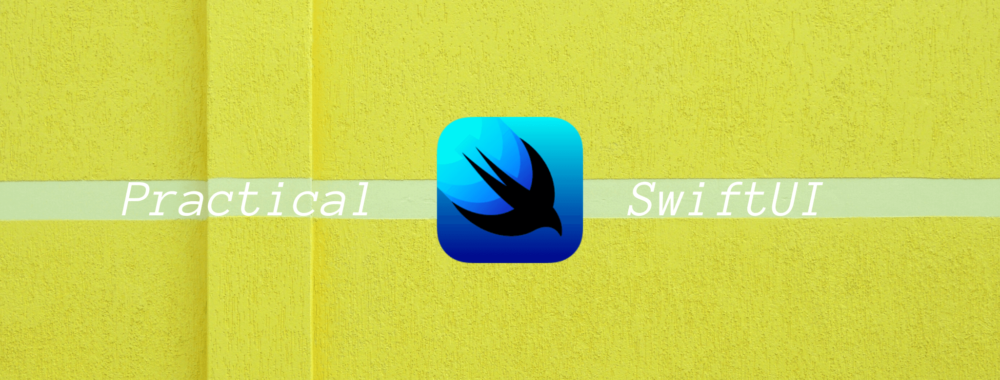

# Practical SwiftUI

- A list of my praticing with SwiftUI tutorials, libraries, videos and articles. 

### Kavsoft
- [Story App UI - Custom Carousel Slider](https://github.com/duonghominhhuy/swiftui-story-app)
- Gradient Picker - Grids, Search Bar, Hex To RGB
- [JSON Parsing - Completion Handlers](https://github.com/duonghominhhuy/swiftui-json-parsing-app)
- Music Player UI - Neumorphic Design 
- 3D Cube - Instagram Story 3D Cube Transition
- [Fashion App UI - Translucent Background Effect](https://github.com/duonghominhhuy/swiftui-fashion-app)
- [Shoe App - Custom Tab Menu's](https://github.com/duonghominhhuy/swiftui-shoe-app) 
- [PHPicker - SwiftUI PhotosUI PHPicker](https://github.com/duonghominhhuy/swiftui-phpicker)
- iMessage Pinned View - Custom Swipe Actions
- Curved Tab Bar - Custom Paths, Solid Animations
- Parallax App - Parallax Scrolling
- Drag And Drop API
- Hero Animation - Custom Animations 
- Login Page - Custom Curves, Shapes, Animations 
- Fitness Dashboard - Bar Charts, Progress Rings
- Firebase Connection - No App Delegate Solution 
- Dating UI - Depth Stacks, Gestures
- Dashboard - Grids, Tab View with Swipe Gestures
- Scroll Reader - Image Picker, Chat UI 
- Carousel List - Custom Grids and Animations 
- Furniture App
- Cloud Firestore CRUD Operations
- Full Stack Login Page
- SwiftUI MVVM Design Pattern

### Find me on:

- [GitHub](https://github.com/duonghominhhuy)
- [Twitter](https://twitter.com/duonghominhhuy)
- Find more Practical topics on [Practical List](https://github.com/duonghominhhuy/practical-list)

