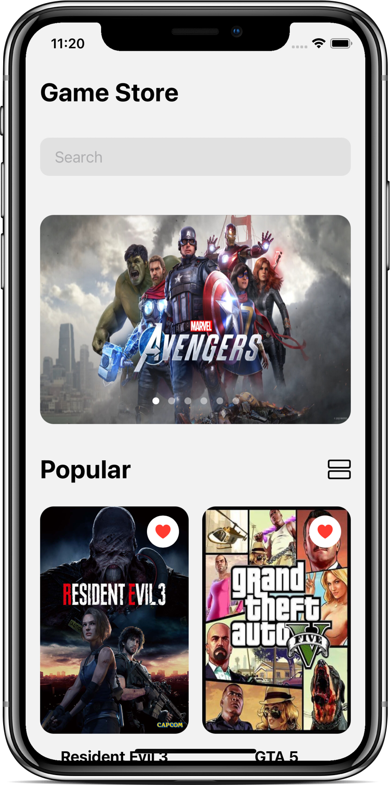

# SwiftUI - Carousel List

- Video by Kavsoft on [YouTube](https://youtu.be/Yn8t3exuml4)

### Preview

      
       
      
       

### Features

- SwiftUI 2.0 & Xcode 12.0.
- Custom Grid, Carousel List.
- LazyVGrid, LazyVStack, GridItem.

### Find me on:

- [GitHub](https://github.com/duonghominhhuy) and [Twitter](https://twitter.com/duonghominhhuy)
- Find more SwiftUI apps on [Practical SwiftUI](https://github.com/duonghominhhuy/practical-swiftui)

