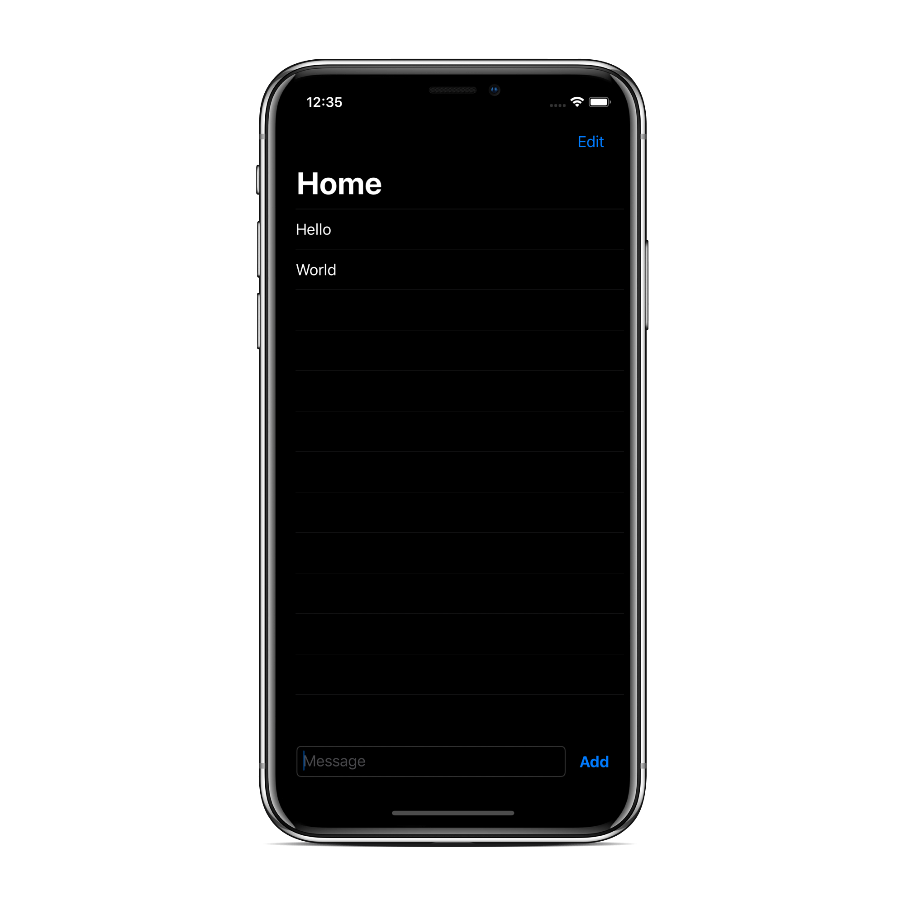
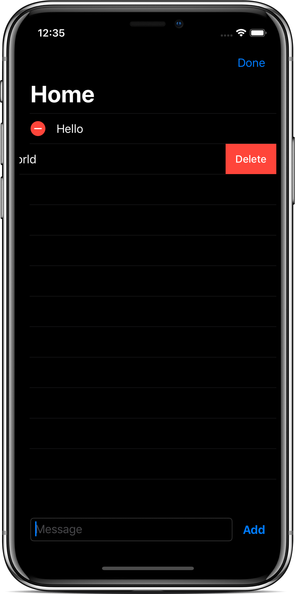
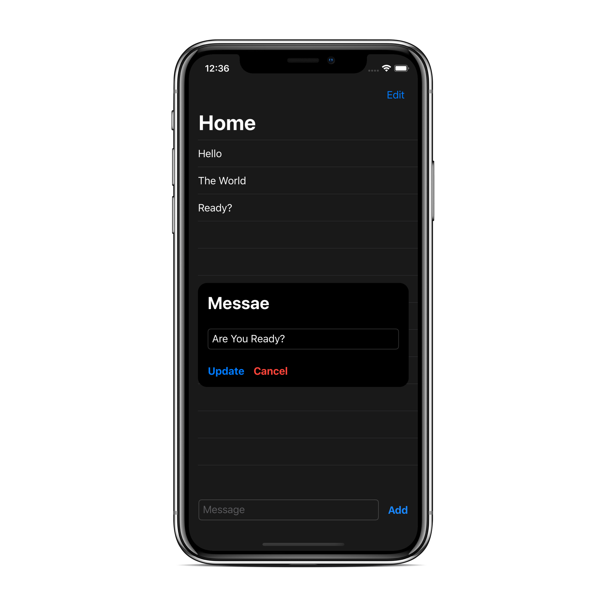
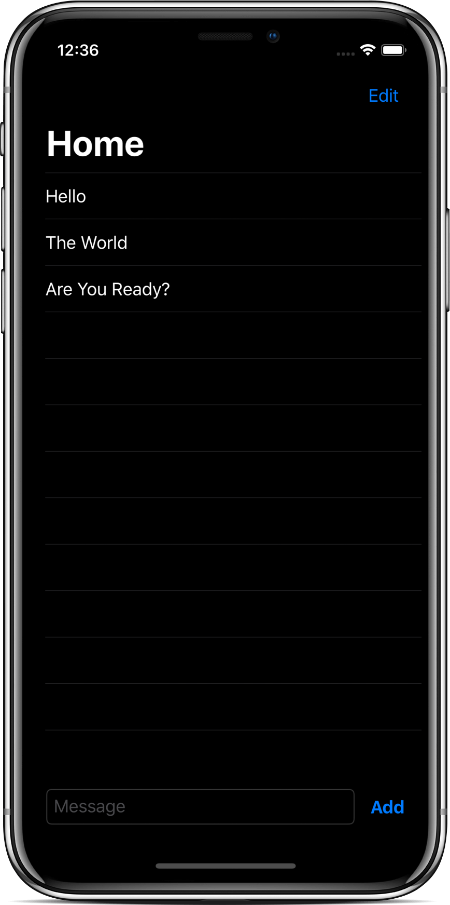

# SwiftUI - Cloud Firestore CRUD Operations

- Video by Kavsoft on [YouTube](https://youtu.be/gZZKJJSVM6E)

### Preview

      
       
      
       

### Features

- SwiftUI 2.0 & Xcode 11.6.
- Firebase, FirebaseFirestoreSwift
- DocumentID, CodingKeys
- MVVM, ObservedObject, State, Binding

### Find me on:

- [GitHub](https://github.com/duonghominhhuy) and [Twitter](https://twitter.com/duonghominhhuy)
- Find more SwiftUI apps on [Practical SwiftUI](https://github.com/duonghominhhuy/practical-swiftui)

