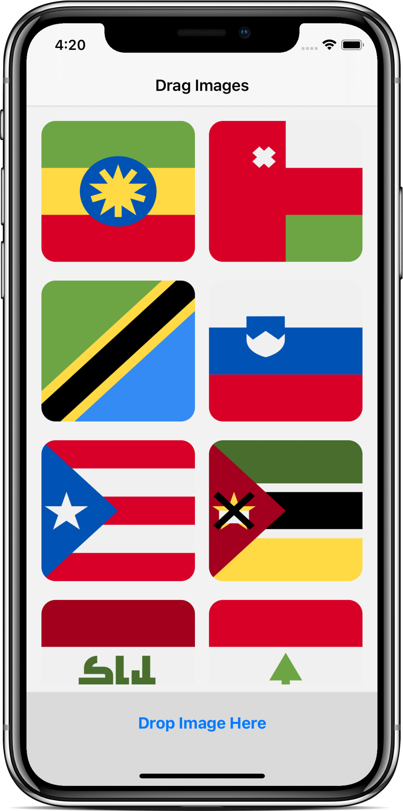
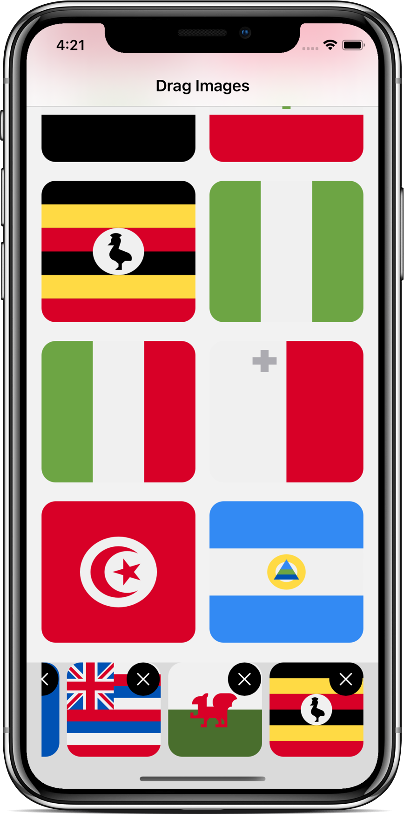

# SwiftUI - Drag and Drop API

- Video by Kavsoft on [YouTube](https://youtu.be/aLC53uoMSY0)

### Preview

      
       
      
       

### Features

- SwiftUI 2.0 & Xcode 12.2.
- MVVM, ObservedObject, Identifiable.
- ScrollView, LazyVGrid, GridItem, ZStack.
- DropDelegate, MobileCoreServices, performDrop().

### Find me on:

- [GitHub](https://github.com/duonghominhhuy) and [Twitter](https://twitter.com/duonghominhhuy)
- Find more SwiftUI apps on [Practical SwiftUI](https://github.com/duonghominhhuy/swiftui)
