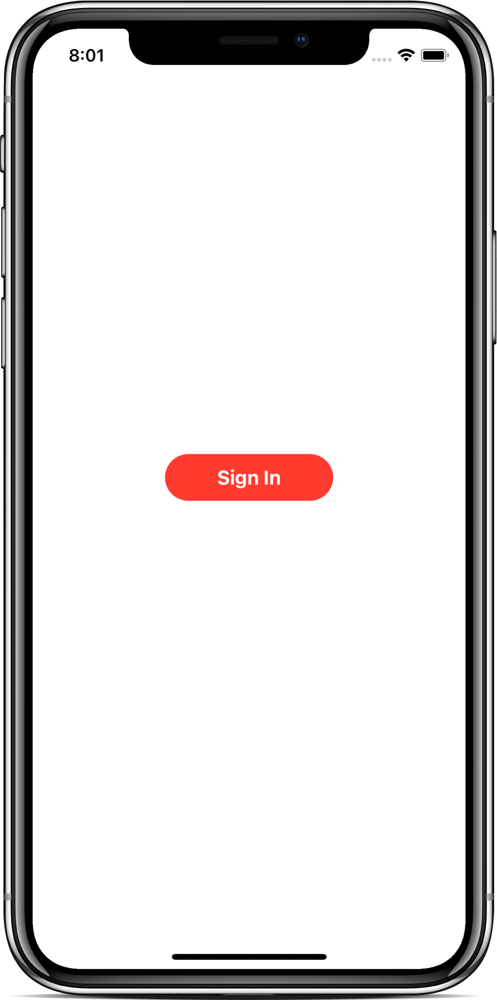
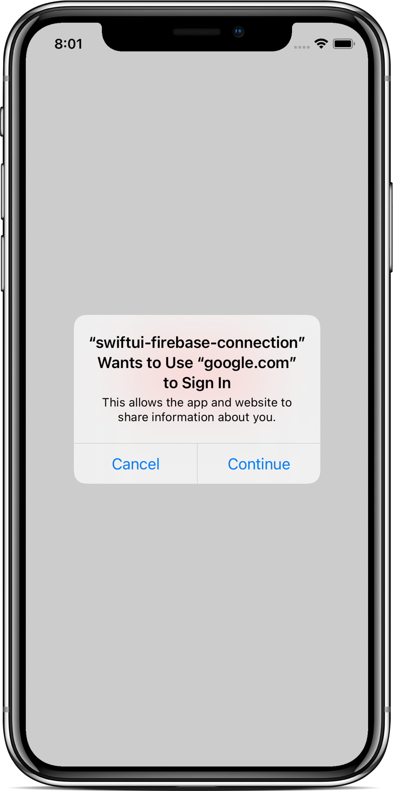
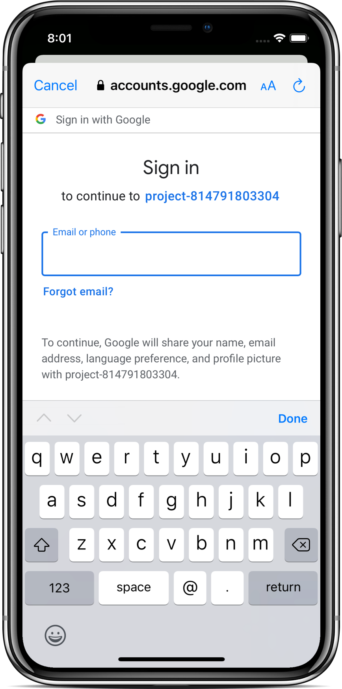
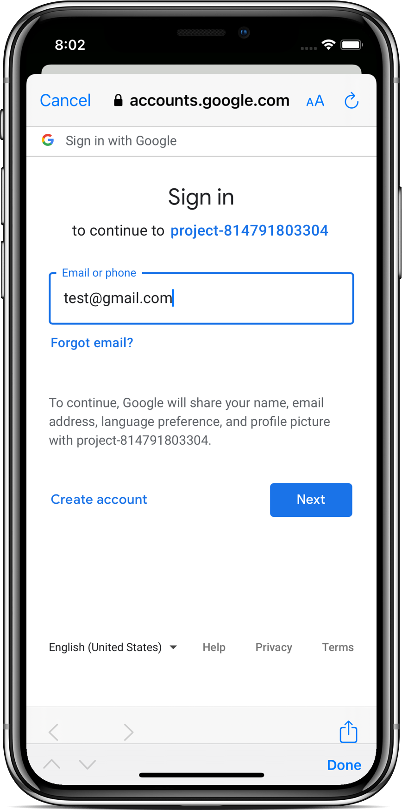

# SwiftUI - Firebase Connection - No App Delegate Solution

- Video by Kavsoft on [YouTube](https://youtu.be/mzoRYuX-nmE)

### Preview

      
       
      
       

### Features

- SwiftUI 2.0 & Xcode 12.0.1.
- Firebase, GoogleSignIn, FirebaseApp, GIDSignIn.
- AppDelegate, ObservableObject.
- UIApplicationDelegateAdaptor, GIDSignInDelegate.

### Find me on:

- [GitHub](https://github.com/duonghominhhuy) and [Twitter](https://twitter.com/duonghominhhuy)
- Find more SwiftUI apps on [Practical SwiftUI](https://github.com/duonghominhhuy/practical-swiftui)

