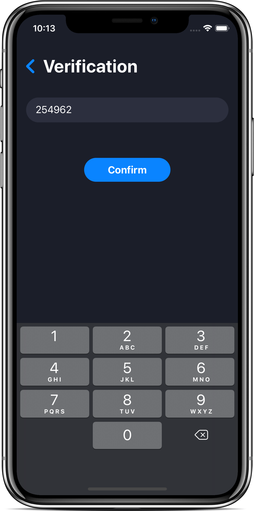
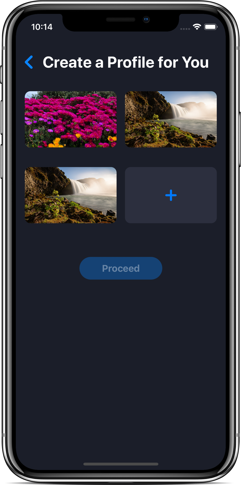
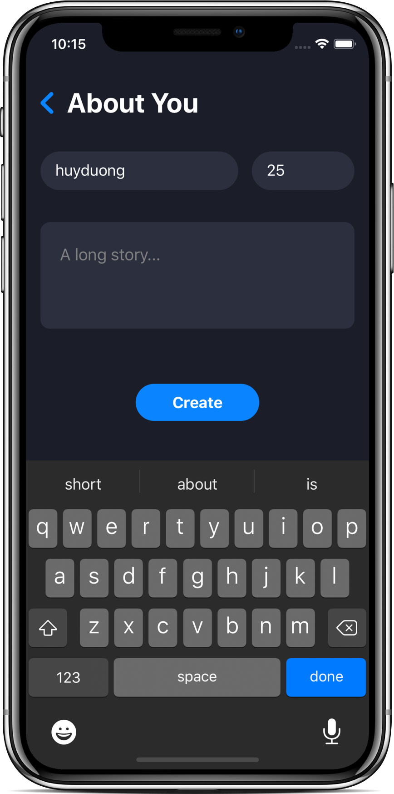
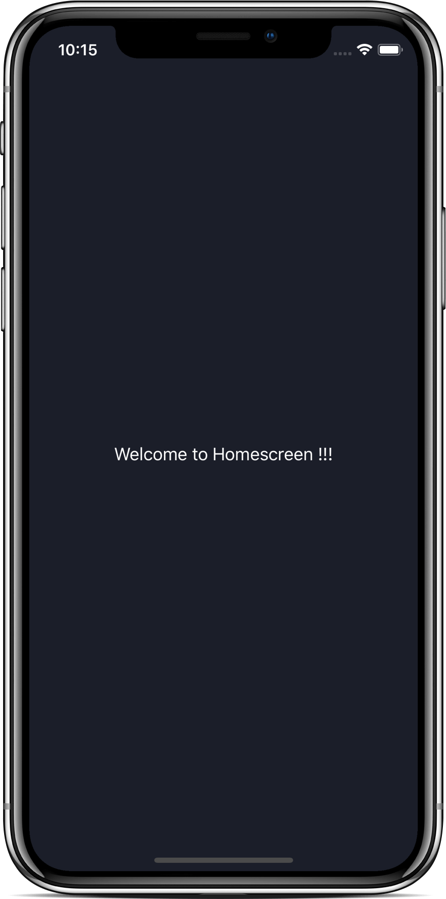

# SwiftUI - Full Stack Login Page

- Video by Kavsoft on [YouTube](https://youtu.be/4RWWfPza_V4)

### Preview

      
       
      
       

### Features

- SwiftUI 2.0 & Xcode 11.6.
- MVVM Design Pattern.
- JSON Decoder.
- UIActivityIndicatorView.

### Find me on:

- [GitHub](https://github.com/duonghominhhuy)
- [Twitter](https://twitter.com/duonghominhhuy)
- Find more SwiftUI apps on [Practical SwiftUI](https://github.com/duonghominhhuy/practical-swiftui)

