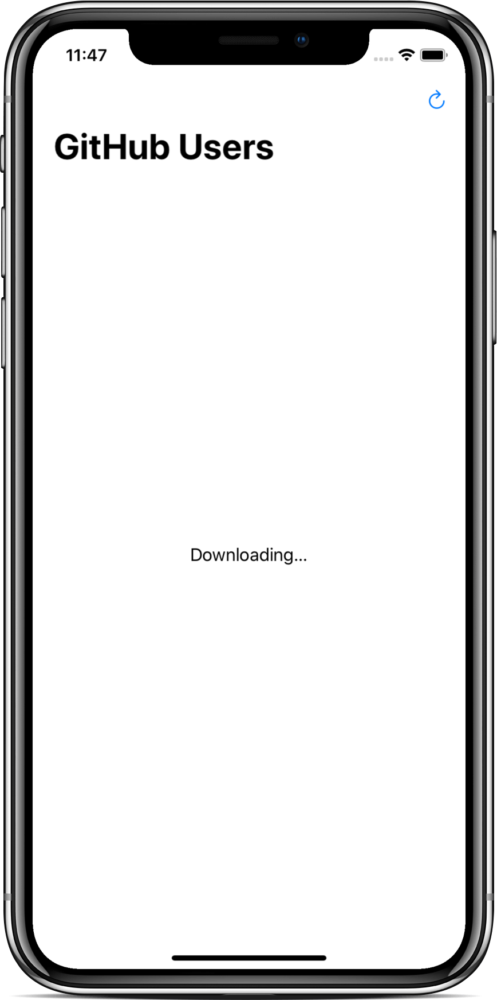
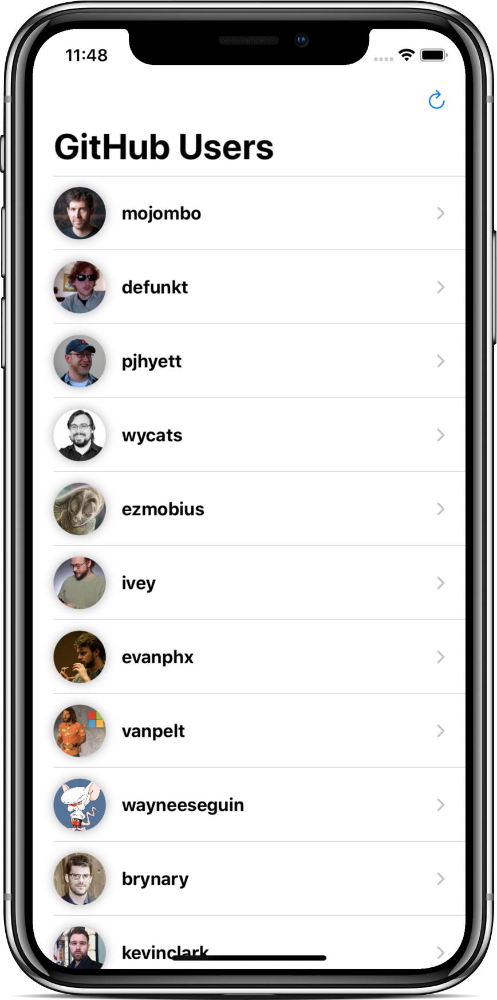
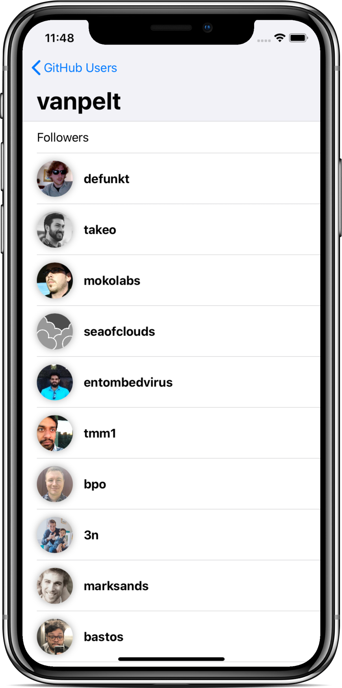
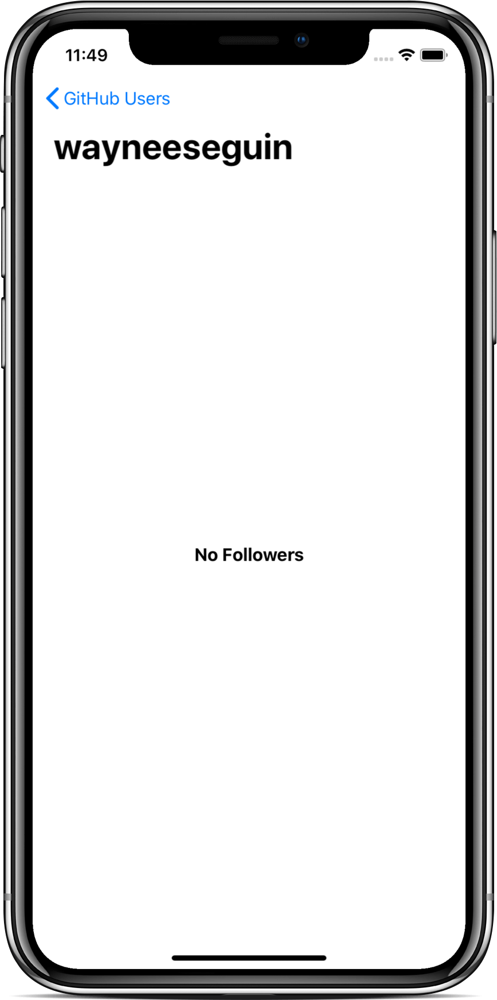

# SwiftUI - JSON Parsing App

- Video by Kavsoft on [YouTube](https://youtu.be/7qI9joPoFIw)

### Preview

      
       
    
       

### Features

- SwiftUI 2.0 & Xcode 11.6.
- JSON Parsing.
- URLSession Data Task.
- Completion Handlers.
- List View & Navigation View.

### Find me on:

- [GitHub](https://github.com/duonghominhhuy)
- [Twitter](https://twitter.com/duonghominhhuy)
- Find more SwiftUI apps on [Practical SwiftUI](https://github.com/duonghominhhuy/practical-swiftui)

