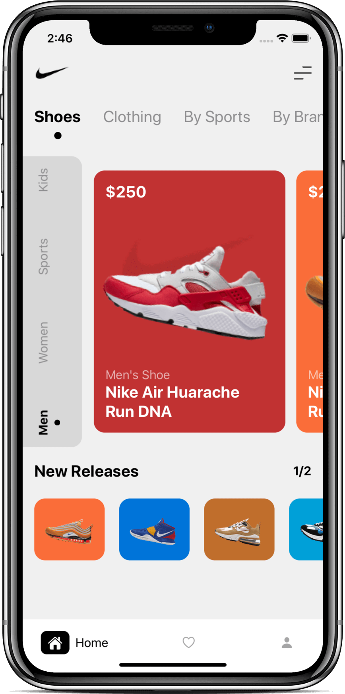
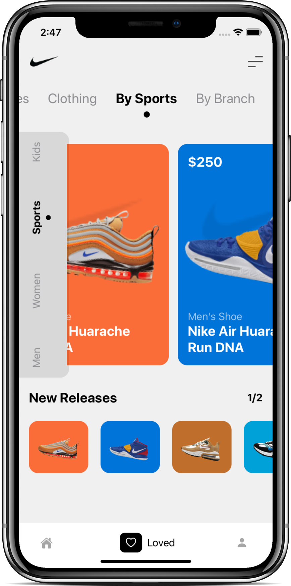
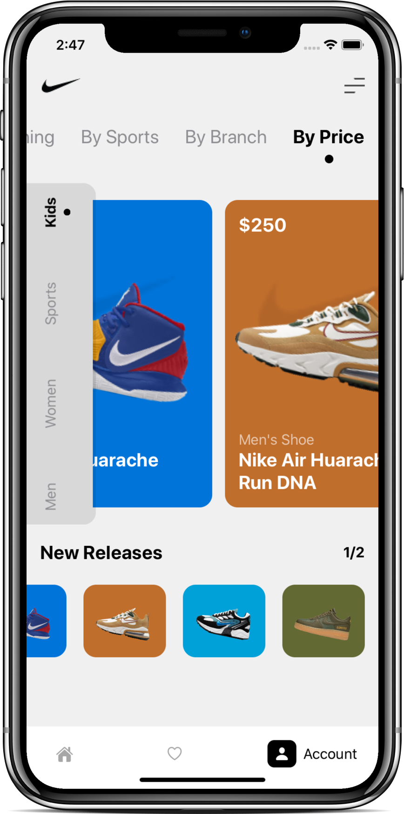
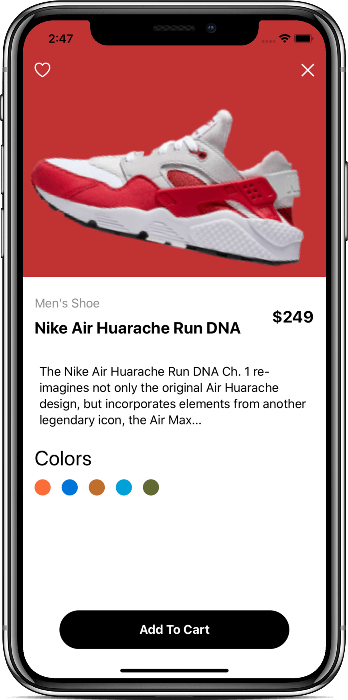

# SwiftUI - Shoe App

- Video by Kavsoft on [YouTube](https://youtu.be/ia1XPWT06Tw)

### Preview

    
     
    
     

### Features

- SwiftUI 2.0.
- Xcode 11.6.
- Custom Menu.
- Custom Tab View.
- Custom Vertical Tab Bar.

### Find me on:

- [GitHub](https://github.com/duonghominhhuy) and [Twitter](https://twitter.com/duonghominhhuy)
- Find more SwiftUI apps on [Practical SwiftUI](https://github.com/duonghominhhuy/practical-swiftui)

