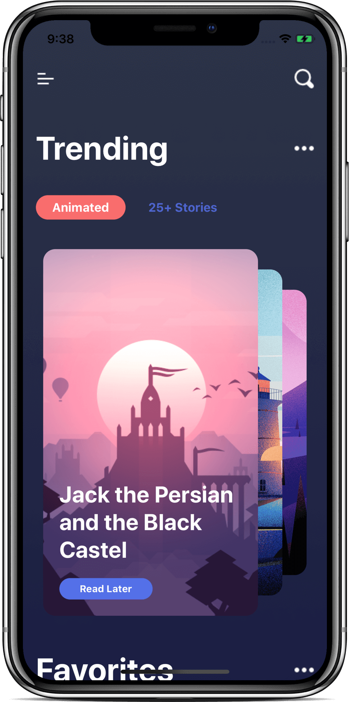
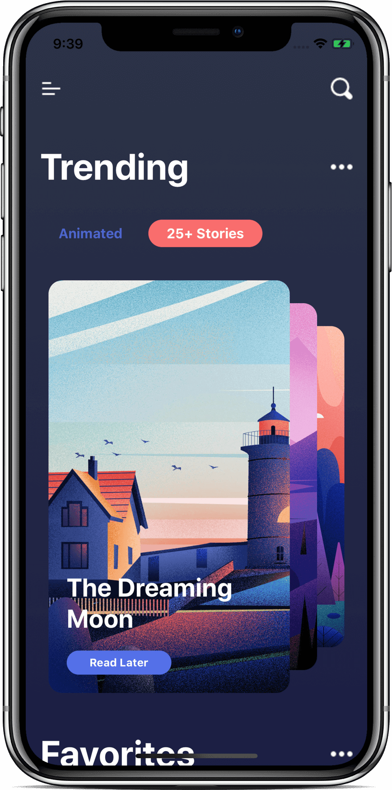

# SwiftUI - Story App UI

- Video by Kavsoft on [YouTube](https://youtu.be/Qk0m5z4uXn0)

### Preview

      
       
      
       

### Features

- SwiftUI 2.0 & Xcode 12 beta 3.
- CoverFlow Carousel.
- Complex UI's.
- Story Telling App.

### Find me on:

- [GitHub](https://github.com/duonghominhhuy) and [Twitter](https://twitter.com/duonghominhhuy)
- Find more SwiftUI apps on [Practical SwiftUI](https://github.com/duonghominhhuy/practical-swiftui)

